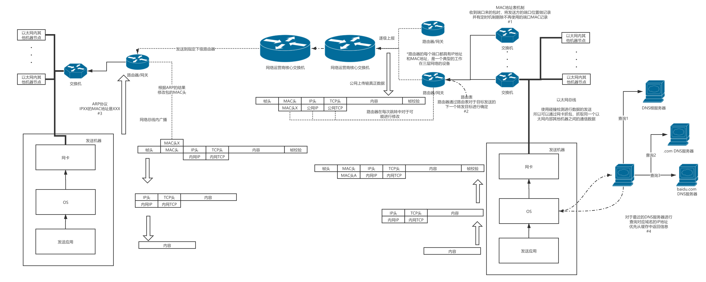

# 网络包的实际收发
## 网络包收发总览图

### 1 交换机的MAC地址表机制
在本质上二层交换机就是一个以太网内部的总线的物理体现，所以其中需要体现总线的相关功能和特点(广播、互通等)，但是由于大部分的网络包其实可以通过MAC地址确定明确的收发者，或者收发端口，所以通过MAC地址表的机制对于非广播的事件进行了优化，其机制如下所述：
+ 交换机在端口收到包之后及那个mac地址和端口位置写入到表中
+ 一段时间不使用的mac地址记录将无效删除

### 2 路由器的路由表机制
为了达成IP包的高速正确传输，路由器通过路由表的机制来进行包传输方向的判定，包括子网、上级网络、以太网等具体的传播方向，再根据传播方向进行包的发送  
一般来说路由表中的路由信息分为以下三种：
+ 直连路由：直接由路由器端口产生的直接路由路径
+ 静态路由：工程师手工配置的强制路由信息
+ 动态路由：通过一系列的路由路由协议生成（RIP、ISIS、EIGRP、OSPF、BGP）知晓网络中每个节点之间的距离并计算得到

路由器还有一个重要的机制就是NAT转换机制
NAT的基本工作原理是，当私有网主机和公共网主机通信的IP包经过NAT网关时，将IP包中的源IP或目的IP在私有IP和NAT的公共IP之间进行转换

### 3 A还有### 3 ARPN uP议机制
ARP（Address Resolution Protocol）即地址解析协议， 用于实现从 IP 地址到 MAC 地址的映射，即询问目标IP对应的MAC地址  
+ 发送包的机器拥有目的地址的IP但是没有MAC地址，通过ARP广播请求，询问指定的IP属于哪个机器
+ 被询问到自身IP的机器单播回复给请求方，告诉当前的MAC地址是多少

此协议也就是为什么在网络中可以使用虚拟IP和可以给网卡任意设定IP的原理

### 4 DNS系统
DNS系统是一种'使用域名寻找IP地址'的一整套的解决方案，其基本的搜寻路径如下所列：
+ 机器寻找最近的DNS服务器，能否从缓存中找到IP地址
+ 找不到则请求根服务器，并提供域名尾端(例如com)
+ 根服务器提供记录com子域名的DNS服务器地址
+ 机器通过提供的DNS子域名逐级进行请求
+ 最终找到实际记录的IP地址或者找不到返回失败