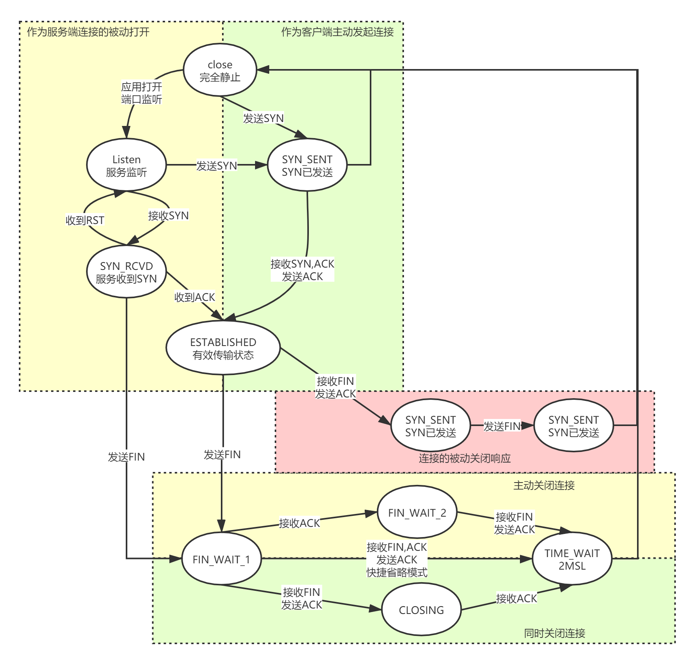

# TCP协议

## tcp协议简介

tcp协议是一个'面向连接'的传输协议，提供了一种可靠的字节流概念给到应用程序进行使用，并且通过各种技术细节(组包，校验和，重发，滑动窗口，序列号等)各种机制来确保数据的传达。  
正因为其提供的强大的封装完整的功能，在大部分的应用需要使用到网络IO的时候，都会优先选择TCP进行处理，只有极少数特殊情况下才会把UDP或者其他同层次的协议放到考量中来

## 连接管理

### 连接的建立和断开(TCP/IP 卷一 13.2)

三次握手：
+ SYN-->
+ SYN,ACK<--
+ ACK-->

四次挥手：
 + FIN,ACK-->
 + ACK<--
 + FIN,ACK<--
 + ACK-->

其他特性：
+ 连接半关闭阶段的数据继续传输
+ 同时打开/关闭连接特殊报文处理
+ 基于本地时间和随机性的初始序列号
+ NAT连接的TCP头转换

### TCP连接的选项(TCP/IP 卷一 13.3)
+ 最大段和最小段：连接建立发送，不能更改
+ 选择确认(SACK)：SYN附带，通信方是否可以接收并描述乱序包确认
+ 窗口缩放项：SYN附带，窗口大小变动的倍率因子
+ 时间戳和防回绕: 通过在TCP包头中加入双方的时间戳预估重传时间，和防回绕序列号一起使用
+ 用户超时选项：用户手动设置愿意等待ACK的时间
+ 认证选项：通过双方加密散列算法和共同维护一个密钥来进行数据认证，并没有广泛使用

### TCP路径最大传输单元计算(TCP/IP 卷一 13.4)

### TCP连接状态转换(TCP/IP 卷一 13.5)

### 重置报文段(TCP/IP 卷一 13.6)

## 超时和重传

## 数据流和窗口管理

## 拥塞控制