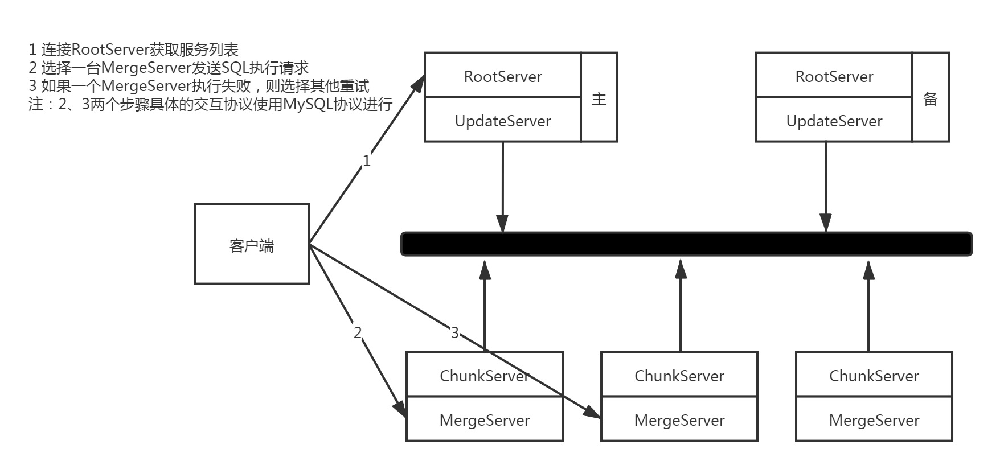
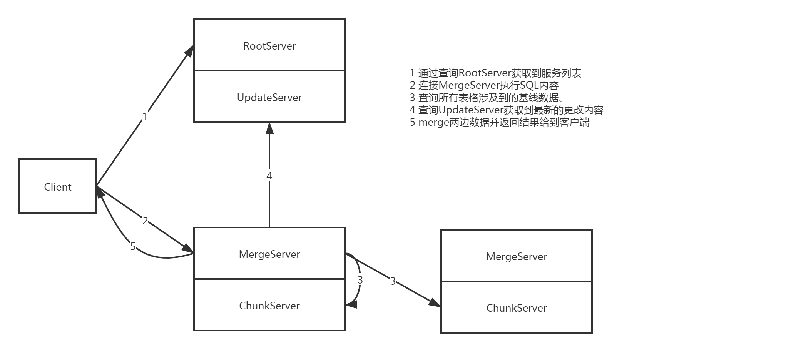
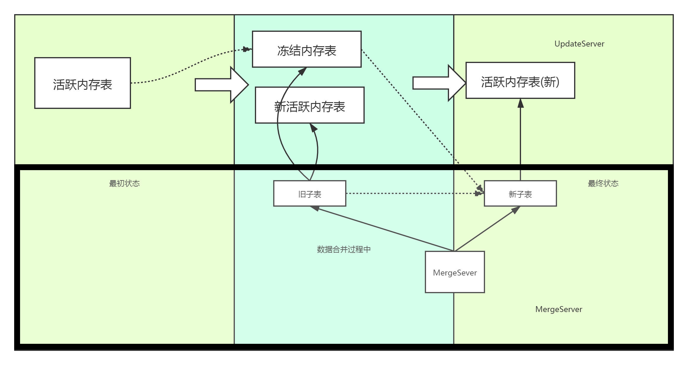

# OceanBase 整体架构

## 服务对外提供的方式

## 各个组件的功能

### RootServer
负责进行集群管理、数据分布管理以及副本管理
也就是提供一个注册中心/配置中心的功能之外，提供一些数据分布管理和副本管理的功能  
在OB内部，对于极限数据按照主键排序并划分成多个子表，默认大小256MB，采用根表一级索引结构   
同时RootServer本身在运行过程中保持主备结构，通过VIP机制进行高可用切换
### UpdateServer
集群中唯一接受写入请求的模块，和RootServer一样，每个集群中只有一个有效并提供服务的UpdateServer节点。  
UpdateServer在进行更新操作的时候首先将内容写入到内存表中，内存表写满之后转存到SSD，其组织方式和ChunkServer中的SSTable一致，但是其中的内容是稀疏的  
为了确保数据不丢失，在更新内存表之前先需要写操作日志文件，并将操作记录同步到备UpdateServer  
宕机重启的时候则通过检查点和操作日志进行状态的回放同步

### ChunkServer
存储子表、提供数据读取服务、执行定期合并、数据分发
OB将表格划分为256M大小的子表进行存储，每个子表由一个或者多个SSTable组成，下面还划分为多个块并且在每个SSTable中按照主键进行存储，读取的时候在单个子表中进行二分查找  
OB内部为了降低在UpdateServer中的数据量，定期有合并的请求进行触发

### MergeServer
协议解析、SQL解析、请求转发、结果合并、多表操作等  
支持MySQL协议的唯一服务，其实可以说是整个提供SQL服务的本体，缓存了部分子表的信息，可以直接查询对应的ChunkServer，还有主要提供数据合并的功能

## 一个简单提供数据服务的案例

## 定期合并&数据分发
定期数据合并过程其实就是把内存中的部分数据同步到基线数据中去

## 架构简析

### 一致性选择

### 数据结构

### 可靠性和可用性

### 读写事务

### 单点性能

### SSD支持

### 数据正确性

###  分层结构
