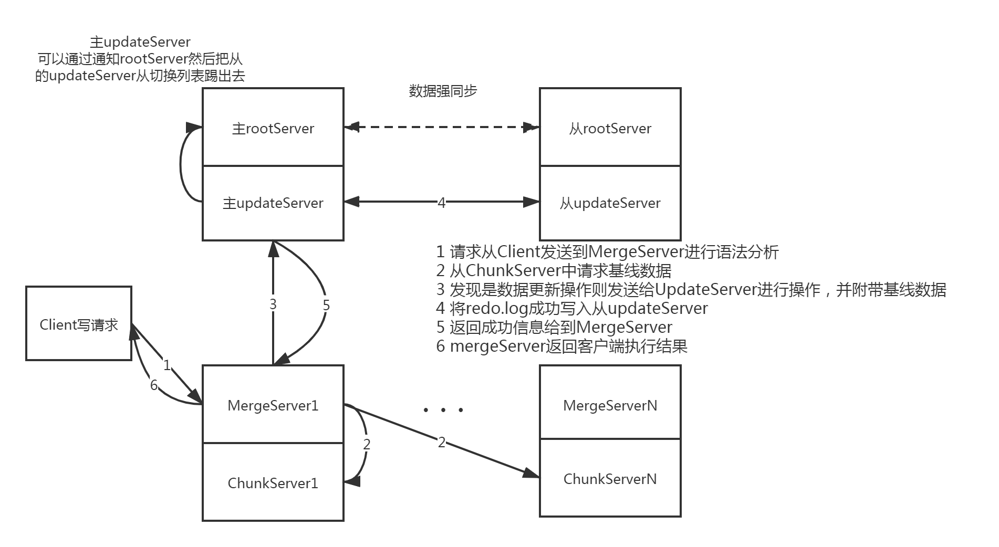

# OceanBase 整体架构

## 服务对外提供的方式

## 各个组件的功能

### RootServer
负责进行集群管理、数据分布管理以及副本管理
也就是提供一个注册中心/配置中心的功能之外，提供一些数据分布管理和副本管理的功能  
在OB内部，对于极限数据按照主键排序并划分成多个子表，默认大小256MB，采用根表一级索引结构   
同时RootServer本身在运行过程中保持主备结构，通过VIP机制进行高可用切换
### UpdateServer
集群中唯一接受写入请求的模块，和RootServer一样，每个集群中只有一个有效并提供服务的UpdateServer节点。  
UpdateServer在进行更新操作的时候首先将内容写入到内存表中，内存表写满之后转存到SSD，其组织方式和ChunkServer中的SSTable一致，但是其中的内容是稀疏的  
为了确保数据不丢失，在更新内存表之前先需要写操作日志文件，并将操作记录同步到备UpdateServer  
宕机重启的时候则通过检查点和操作日志进行状态的回放同步

### ChunkServer
存储子表、提供数据读取服务、执行定期合并、数据分发
OB将表格划分为256M大小的子表进行存储，每个子表由一个或者多个SSTable组成，下面还划分为多个块并且在每个SSTable中按照主键进行存储，读取的时候在单个子表中进行二分查找  
OB内部为了降低在UpdateServer中的数据量，定期有合并的请求进行触发

### MergeServer
协议解析、SQL解析、请求转发、结果合并、多表操作等  
支持MySQL协议的唯一服务，其实可以说是整个提供SQL服务的本体，缓存了部分子表的信息，可以直接查询对应的ChunkServer，还有主要提供数据合并的功能

## 一个简单提供数据服务的案例

## 定期合并&数据分发
定期数据合并过程其实就是把内存中的部分数据同步到基线数据中去

## 架构简析

### 一致性选择
CAP理论下通过牺牲部分的高可用性能来满足其他两个部分的实现
在进行redo.log写入的时候要求和备机进行同步，当且仅当备机同步写完redo.log的时候才返回客户端成功。并且允许主机由于网络问题决策踢出部分备机，同时这些被踢出的备机不再可以执行高可用切换。

### 数据结构
分成以下两种部分的数据
+ 基线数据 多副本存储在chunkServer中 
+ 增量数据 内存+磁盘存储在UpdateServer中

### 可靠性和可用性
OceanBase这个项目基本依赖大量的冗余来确保项目的可靠性
+ 基线数据由于在不同chunkServer中存放3个以上的副本来支持，并且由于是冷数据，所以数据完全一致，存在可替代性
+ UpdateServer中的数据通过主从进行冗余，并且底层通过文件系统进行多副本化

综合上文的两个特点，不论是哪个Server宕机，可用性都不会有太大的损失

### 单点性能
UpdateServer单点为整体架构中的明显缺陷，限制了OB的整体读写性能  
但是由于人为OB的读写不会因为单点的服务器变成瓶颈，理由如下：
+ 海量数据不可能每天都大量读写，大部分情况下UpdateServer的内存容量能够支持变更的内容
+ 更新的数据会被定期的下推到各个chunkSever中去
+ 网络流量上来看UpdateServer机器的流量也不会被打满
+ 使用非易失性的内存存储来提高UpdateServer的落盘性能

### SSD支持

SSD块写的特性导致了随机写的性能差，所以采用整块写入来对于这个部分进行优化，块大小为512-2M的块

### 数据正确性
各种层面的校验来确保数据的正确性，包括存储的数据以及传输的数据：
+ 数据存储校验
+ 数据传输校验
+ 数据副本校验
+ 数据镜像校验

## UpdateServer内部实现
线程实现模型

数据使用存储机制

## ChunkServer内部的数据模型

